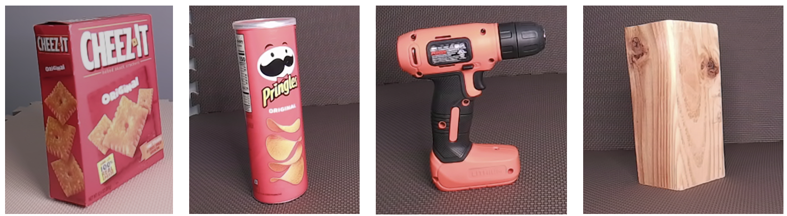

<h1 align="center"> 3D Object Reconstruction Through Integration of Hyperspectral and RGB-D Imaging </h1>

## 📄 Abstract

This work explores the integration of RGB-D and hyperspectral imaging technologies to enhance the accuracy of 3D reconstructions. We propose a methodology that combines depth maps from an RGB-D camera with spectral data from a hyperspectral camera to develop a detailed 3D hyperspectral point cloud model. 

## 🔬 Research Methodology

### Spectral Processing Approaches
1. **HSI_Mean**: Averaging all spectral bands to create grayscale images
2. **HSI_False Color**: Extracting three specific bands (435nm, 545nm, 700nm)
3. **HSI_All**: Utilizing all available spectral bands (400-800nm with 5nm intervals)

## 🧩 Dataset

<p align="left">
  
</p>

### Dataset Composition
Our dataset comprises hyperspectral images of diverse objects:

- Cracker Box (rectangular)
- Chips Can (cylindrical)
- Power Drill (irregular-shaped)
- Wood Block (wooden surface)

### Data Access
- **Download Link**: [Hyperspectral Image Dataset](https://extra.u-picardie.fr/nextcloud/index.php/s/85AFBNLYx88JFqt)
- **Instructions**:
  1. Download the compressed dataset
  2. Extract files to the same directory as your project code
  3. Ensure file paths are correctly configured in your scripts

## Prerequisites
- Python 3.8+
- OpenCV
- NumPy
- Open3D
- Required libraries: `pip install opencv-python numpy open3d`

## 🚀 Quick Start Guide
## Step 1: Feature Matching

### Running the Script
1. Navigate to the script directory
2. Run `python 1_Feature_Matching_All.py`

### Object Selection
When prompted, you'll see available objects:
```
Available objects:
1. Chips can (26 frames)
2. Cracker box (25 frames)
3. Power drill (29 frames)
4. Wood block (24 frames)
```

### Recommended First Run
- Select object: `2` (Cracker box)
- Distance threshold: `10`

### What Happens
- The script processes hyperspectral image bands
- Performs feature matching between consecutive frames
- Computes transformation matrices
- Saves transformation data in `transformation/all/Cracker box/`

### Output
- Multiple `.npz` files containing:
  - Transformation matrix
  - Fitness score
  - Number of valid matches
  - Distance threshold used

## Step 2: Point Cloud Registration

### Running the Script
1. Ensure feature matching results exist
2. Run `python 2_Registration_All.py`
3. Select the same object as in Step 1 (Cracker box)

### What Happens
- Converts depth and RGB images to point clouds
- Applies transformations from Step 1
- Performs global optimization
- Removes outliers and downsamples point clouds

### Output
The script generates a final point cloud file:
`results/all/Cracker box/3_final_result_All.ply`


## 📊 Performance Metrics and Quantitative Evaluation

#### 1. Chamfer Distance
- **Definition**: Bidirectional similarity metric between point clouds
- **Calculation**: Computes average minimum point-to-point distances

#### 2. Hausdorff Distance
- **Definition**: Maximum distance between point sets
- **Calculation**: Captures worst-case point displacement

### Evaluation Approaches
The quantitative evaluation compares generated point clouds against ground truth (GT) using three spectral processing techniques:
- HSI_Mean
- HSI_False Color
- HSI_All

### Running Quantitative Evaluation

#### Prerequisites
- Ensure Python environment with required libraries:
  - open3d
  - numpy
  - scikit-learn
  - matplotlib
  - seaborn

#### Execution Steps
1. Navigate to the Evaluation directory
2. Run the specific evaluation script:
   ```bash
   python Quantitative_evaluation_Cracker_box.py
   ```

#### Expected Output
The script will:
- Load ground truth point cloud
- Process generated point clouds
- Compute Chamfer and Hausdorff distances
- Display comparative metrics

### Metric Interpretation
- Lower Chamfer Distance: Better reconstruction accuracy
- Lower Hausdorff Distance: More consistent point cloud mapping
- Point Count: Indicates reconstruction density

## 🖥️ Visualization Tools

Recommended Tools for Point Cloud and 3D Data Visualization:

1. **CloudCompare**
   - Download: [Official CloudCompare Website](https://www.cloudcompare.org/)


2. **MeshLab**
   - Download: [MeshLab Official Site](https://www.meshlab.net/#download)


## 📄 License

[Specify license]

## 📚 Citation

If you use this work in your research, please cite:
```
[Publication Details]
```
